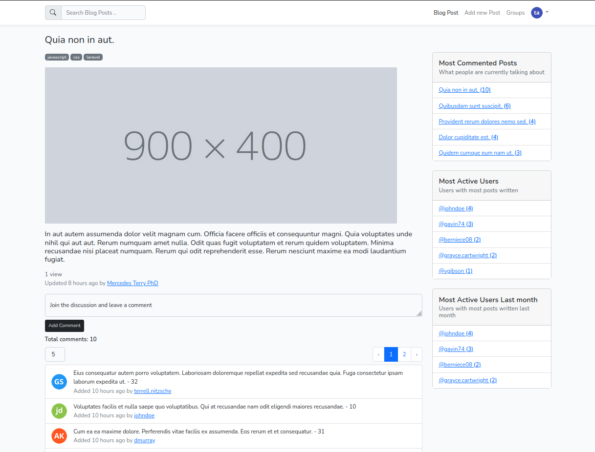

# Blogger

PHP-Laravel Blogger System

### Captures


---

The following must be installed and available on your terminal:

* [x] composer
* [x] npm

---

## Starting Project

1. install laravel packs
```composer
composer install
```

Run the following command to generate your app key:

```
php artisan key:generate
```

Create the symbolic link:

```
php artisan storage:link
```

Run the database migrations (**Set the database connection in .env before migrating**)

```
php artisan migrate
```

2. install npm and run
```npm
npm install
```
```npm
npm run dev
```

----- 
Need helps? Reach me out

> Email: soulaimaneyahya1@gmail.com

> Linkedin: soulaimane-yahya

All the best :beer:
